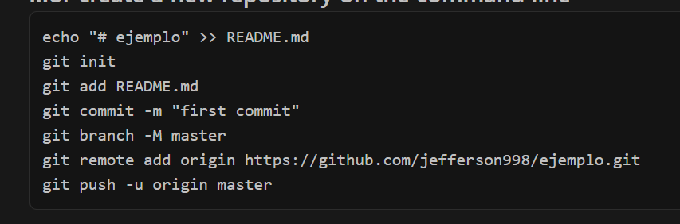
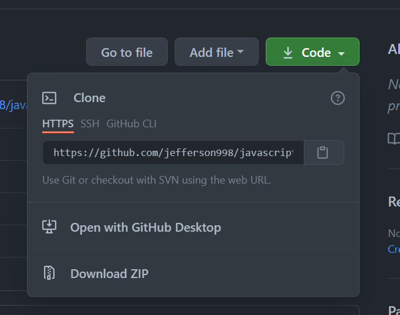

# RetoAvianca
En este repositorio se realiza el reto Avianca con POM y popUp para mostrar los resultados el resumen de viaje

## Preguntas 

- Una clase es una plantilla o estructura que contiene a los objetos
y sus metodos.
- Y un objeto es un componente que a su vez este se agrupara de métodos
y características del objeto.

### Los pasos para versionar en github
- Lo primero que se realiza es crear un repositorio desde la página
web 
  
  
Aquí se creará el repositorio con las características que se necesiten

- si se crea sin el README.md el cual es el archivo que mostrará información
del repositorio se debe realizar en la linea de comandos los siguiente comandos
  
  - El primer comando creara el archivo README.md 
    -Luego con `git init` se iniciara un repositorio en el local 
    - con `git add . ` o `git init README.md` con el primer comando
    se agregarán todos los archivos mientras que el otro agregará
      archivos específicos
        
    - luego se hace un comentario o nombre al cambio que se realizá
        con `git commit -m "first commit"`
        
    - luego se realizá la creación de una rama en el entorno local 
            con `git branch -M master` el ultimo es el nombre de la rama 
      
    -se realiza la conexión con el repositorio alojado
          con `git remote add origin https://github.com/jefferson998/ejemplo.git`
          la url será del repositorio que hemos creado en Github web
         
    - Para finalizar se realiza un push o subida de nuestros archivos con 
    `git push -u origin master` con la bandera -u se creará un seguimiento de las ramas
      y su información 
      
### si por el contrario no se crea vacio dara la opción para clonar y se realizará el proceso desde 
### la conexion al remoto con la siguiente url

En este caso con el repositorio se hará un clone al alojado en el local
con 
`git clone https://github.com/YOUR-USERNAME/YOUR-REPOSITORY`
y se guardaran todos los archivos que se quieran subir en la ruta donde este el archivo `.git` 
y se realizarán los pasos desde git add git commit y git push.
      

  

Se realizo con POM 
para la pagina **https://www.avianca.com/co/es/** 
y se utilizo Datos llamados desde Excel AviancaViajes.xlsx

## estructura de POM

## PopUp solo ida
Resumen de viaje
En esta ocasion se hace el resumen de un viaje 

## PopUp Ida Y Vuelta
Resumen de viaje

